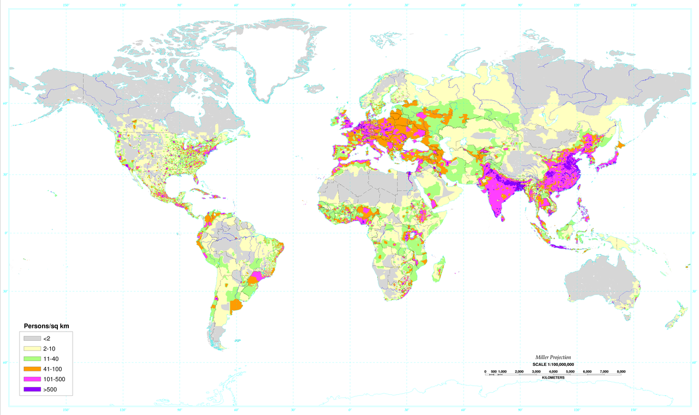
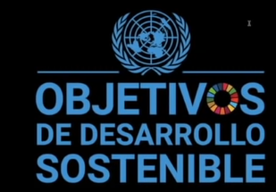
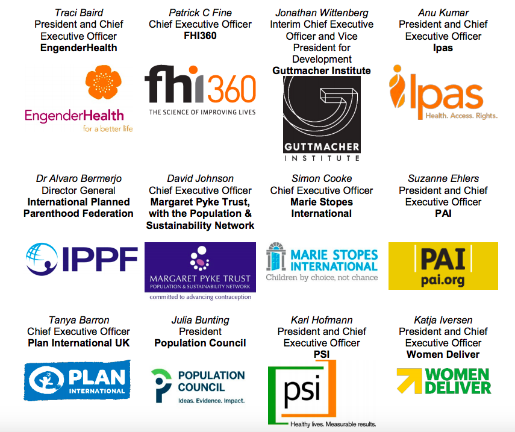
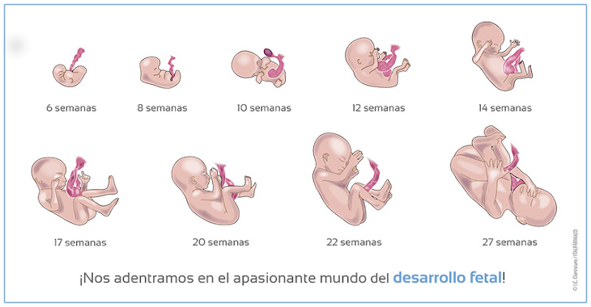

# Aborto Análisis del Fenómeno
Recientemente se dio el hecho de la despenalización del aborto en la Corte Suprema de México, alegando básicamente lo que dice la ONU y grupos feminista, sin siquiera tomar en cuenta si es una vida o no, dado que no mencionaron nada de eso, solo hablaron temas sobre:

* Salud Reproductiva
* Derechos y Libertad
* Pobreza

 
# ¿Qué es el aborto?
Básicamente es el finalizar la  una vida humana que se está formando en la etapa embrionaria y/o fetal.   

## ¿Pero cómo se llegaron a este fenómeno en la actualidad?
Definitivamente el origen viene de la teoría [neomalthusiana](https://es.wikipedia.org/wiki/Neomalthusianismo) propone planificar de modo centralizado los nacimientos de modo que sean algunos quienes decidan quiénes deben nacer y quiénes no.   
¿Razonamiento de fondo? A menor número de personas, mejor distribución de la riqueza.
¿Pero aquí viene la pregunta entonces como aplicarla?    

# ONU y OMS
 También la ONU y la OMS vienen promoviendo el aborto esto desde hace mucho tiempo, solo con buscar "Artículos ONU aborto" encontraran muchos artículos sobre este tema, claro solo diciendo derecho. Pues es solo un método de control poblacional, según somos muchos cuando, es realmente una falacia, pues solo los primeros 5 o 6 países constituyen el 80 % o más de la población mundial, hay una mala distribución de la población.

### Cumbres de la ONU:
  * Conferencia Mundial de Población Bucarest 1974
  * Conferencia Internacional sobre Población y Desarrollo Cairo 1994
  * Conferencias mundiales sobre la mujer Pekin 1995
  * Cumbre de la Tierra de Río de Janeiro Rio de Janeiro 1992

Aquí donde sale toda la propaganda del **ABORTO** , pero sin decirlo como lo es realmente, solo dicen “Asegurar acceso a  derechos de salud reproductiva o sexual”.

Otro claro, ejemplo actual es este de aquí *"Genero, Salud y la agenda 2030 para el desarrollo sostenible"*. 
Aqui viene otra pregunta que es la agenda 2030?.  

### Agenda 2030
Si vemos la página de la agenda 2030 también marca como sus pilares fundamentales la imposición del aborto en todo el mundo
para poder desarrollar su agenda de 17 objetivos sustentables. Pero no lo dice tal cuál es **aborto**, lo dice como "Derechos Humanos" para hacerlo mundialmente aceptable.   
Dado que, si lees alguno de estos artículos, te darás cuenta que dice **derechos humanos, salud sexual o reproductiva, factor de desigualdad**.   

Aqui es donde claramente ya, entran las empresas en juego, pues aquí vemos a **Planned Parenthood** fue una de las 12 organizaciones (todas abortistas), detrás de los Acuerdos de París con respecto al clima. ¿Lo sabías? Son estas: EngenderHealth, FHI360, Guttmacher Institute, Ipas, International Planned Parenthood Federation, Margaret Pyke Trust, Marie Stopes International, PAI, Plan International UK, Population Council, PSI y Women Deliver.

Aquí yo me pregunto y que tiene que ver el clima con el aborto si vemos más abajo veremos la respuesta asi como la relación de las empresas interesadas.

# Planned Parenthood y demás empresas
Es inevitable ver como empresas abortivas básicamente siguen estos lineamientos y formas de pensamiento pues al final son aliados comerciales.  
¿Ejemplos? **Margaret Sanger**, fundadora de la multinacional abortista **Planned Parenthood Federation International**, quien apoyó abiertamente las prácticas eugenésicas.

Planned Parenthood. Por ejemplo, esto afirman en su sitio web: **“Al considerar soluciones a la crisis del cambio climático, los servicios de salud sexual y reproductiva podrían no ser lo primero que se nos ocurra, pero en realidad podrían desempeñar un papel muy importante en estrategias ambientales positivas.”**

# El aborto es un negocio
Al analizar esta agenda básicamente vemos que aquí hay un interés desmedido ahora en muchos países de promover el aborto y vemos en medios de comunicación masiva el **'proselitismo al aborto'**

Hay que analizar si el negocio es redituable y al investigar un poco podemos ver que si:  
Planned Parenthood calcula, hay **más 214 millones de mujeres y niñas que pueden quedar embarazadas** y hay 99.1 millones de embarazos no plafinicados" , si solo abortaran el 20% cobrando un promedio de 200 usd por aborto, impulsando leyes para que sea de forma gratuita pagando con los impuestos de los ciudadanos, la forma de ganar dinero claramente esta ahi.  

Si contamos por ejemplo que también hay otras formas de sacar dinero por ejemplo la empresa **"Semonyx"** (algunos de sus clientes son empresas de estos productos, Ocean Spray, Tropicana, Gatorade) que utiliza células fetales para poner a prueba sus potenciadores del sabor de los alimentos y bebidas. Pues la ganancia seria aún mayor.

# Aborto es correcto o no
Bueno vemos que hay muchos intereses en juego, pero lo que debería de importar es esto, **“Es correcto abortar”** es **“un ser humano”** a no lo es, **¿en qué momento inicia la vida?**     
Creo que aquí es donde se debe de centrar tus y tus hijos e hijas.  

> Si no es humano sería correcto, pero si es humano seria claramente un delito, ¿dado que cual derecho o libertad puede estar por encima de la vida de una persona?  

Claramente la forma de llegar a saber es mediante la ciencia. en este caso la medicina.  

La medicina en la **rama Ginecobstetra, Especialidad materno-fetal, nos dice que:**
- Tras la fecundación que es la unión del ovalo y el espermatozoide forman una nueva célula que se llama **"Cigoto"** que tiene todo el material genético para formar un ser humano, que es diferente de la madre, pues contiene 46 cromosomas en el cigoto.
- Aquí es donde empiezan claramente la discusión: **es un conjunto de células de la madre "no es humano”**, pero ya vimos que no es así, además tenemos lo siguiente.
- Como se dijo el "cigoto/conjunto de células" que contiene 46 cromosonas, claramente las que tienen todas las personas sin importar en qué fase de la vida estén.
- Semana 5 tiene un corazón que se llama primitivo
- Semana 6 empieza la formación de los órganos
- Semana 8 pasa de ser embrión a feto. 

Bueno aquí creo que no tendría caso seguir pues es claro de comprobar, dado que después ya está formado el ser humano en su totalidad. (**Increíblemente buscan el aborto hasta los 9 meses**).

Por ejemplo, como comprobar si un feto es humano, si un humano es humano, o si un cadáver fue de un humano:
> Fácil, has una prueba de ADN para saberlo, si se le hace a un feto saldrá que es humano, se hace una prueba de ADN a la madre, saldrá diferente sin duda.

**¿Entonces son sus células?**, es el mismo cuerpo? **puede una persona tener dos tipos de ADN y dos pares de 46 cromosomas en el mismo cuerpo?**, o es otro ser humano.   
Claramente lo es. Y porque los jueces de la suprema corte no tomaron en cuenta esto, sin duda por interes!. 

Referencias:  
<http://www.revistamovimiento.com/historia/conferencia-mundial-de-poblacion-de-bucarest-1974-un-triunfo-de-la-argentina-frente-al-mundo>  
<http://www.unfpa.org/sites/default/files/pub-pdf/icpd_spa.pdf>  
<http://www.unwomen.org/es/how-we-work/intergovernmental-support/world-conferences-on-women>  
<http://www.un.org/spanish/esa/sustdev/documents/declaracionrio.htm>  
<http://www.researchgate.net/publication/327266711_Gender_health_and_the_2030_agenda_for_sustainable_development>  
<http://es.wikipedia.org/wiki/Margaret_Sanger>  
<http://www.lifesitenews.com/blogs/ocean-spray-tropicana-gatorade-also-on-list-of-products-using-aborted-fetal>  
<http://www.natalben.com/desarrollo-feto-semana-a-semana>    

